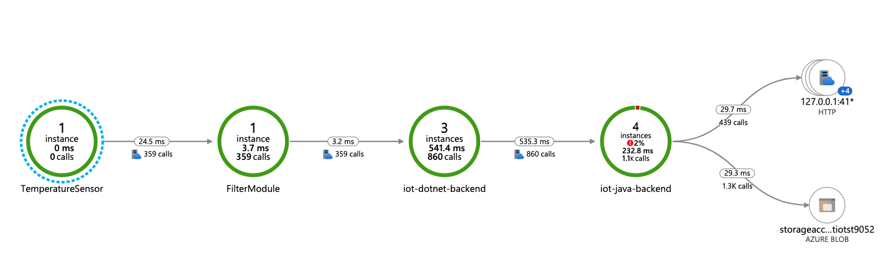

# Iot Edge Distributed Tracing sample

The sample demonstrates implementation of end-to-end distributed tracing with [OpenTelemery]().  

Please see the [Overview of Distributed Tracing with IoT Edge](https://csefy19.visualstudio.com/CSE_Engineer_for_Reuse/_boards/board/t/DevOps%20and%20Infrastructure/Stories/?workitem=493299) to understand the concept and different architecture paterns. 

At this point, the sample implements the "online" scenario when an IoT Edge device is normally online and has a constant access to an Application Insights instance.  

The topology of the sample is represented on the following diagram:

There is an IoT Edge device with `Tempperature Sensor` custom module (C#) that generates some temperature value and sends it upstream with a telemetry message. This message is routed to another cusom module `Filter` (C#). This module checks the received temperature against a threshold (25 degrees) and if it exceeds the threshold, the FilterModule sends the telemery messsage to the cloud.

In the cloud the message is processed by the backend. The backend consists of a chain of two Azure Functions and a Storage Account. 
Azure .Net Function picks up the telemetry message from the IoT Hub events endpoint, processes it and sends it to Azure Java Function. The Java function saves the message to the storage account container. 

The C# components of the sample, such as device modules and backend Azure .Net Function use [OpenTelelmerty for .Net]() to produce tracing data. They send the tracing data to Application Insights with [Azure Monitor Open Telemetry direct exporter](). They also send correlated logs directly to Applicaion Insights with a configured ILogger instance.

The Java function uses [OpenTelemetry auto-instrumentation Java agent]() to produce and export tracing data and correlated logs to the Application Insights instance.  

The IoT Edge module `Tempperature Sensor` starts the whole process and therefore it starts an OpenTelemetry trace. It puts a [W3C traceparent]() value into the outgoing message property. The `Filter` receives the message on the device, extracts the `traceparent` property and uses it to continue the trace with a new span. The module puts a new value of the `traceparent` (with the new parent_id) into the outgoing message. The .Net Azure Function retreives the mesage from the IoT Hub endpoint, extracts the `traceparent` property, continues the same trace with a new span and sends the new `traceparent` value in the header of the HTTP request to the Azure Java Function. The Azure Java Function is auto-instrumented with OpenTelemetry, so the framework "understands" the `traceparent` header, starts a new span in the same trace and creates the following spans while communicating to Azure Blob Storage and Managed Identity service.

## Result
As a result, the entire end-to-end process from the sensor to the storage can be monitored with Application Map in Application Insights:

As well as every trasaction (trace) can be investigated in details:

[picture]. show with an error.

So we can drill down and explore correlated logs for a specific trace or a specific span:

[picture]

## OpenTelemetry Collector
Besides Application Insights, `Tempperature Sensor` and `Filter` IoT Edge modules export the tracing data via OTLP protocol to the `OpenTelelemtryCollector` module, running on the same edge device. The collector module can be configured to export the tracing data to alternative observability backends, working on the factory floor (for example [Jaeger]() or [Zipkin]()). _Note_: Jaeger/Zipkin instalation is not includded in this sample.

[picture]

<!-- 
TODO:

## Configurations
Specific dist tracing configurations pwer each layer
  

## Deployment
To deploy the sample run the PowerShell script `./Scripts/deploy.ps1` and select the `Distributed Tracing` option when asked.   -->

 

