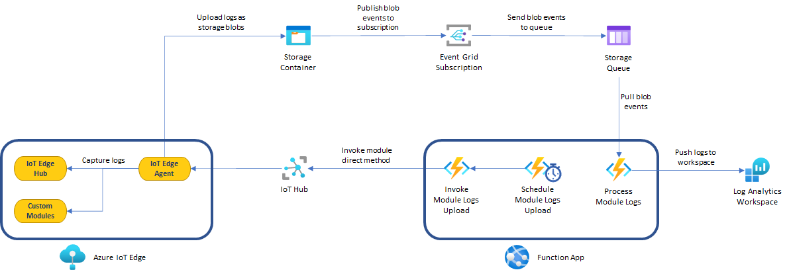
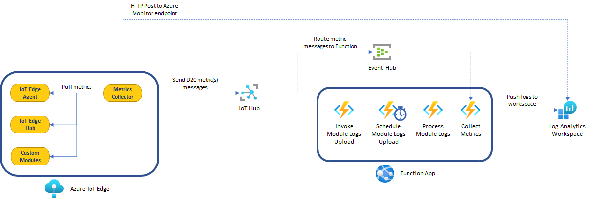
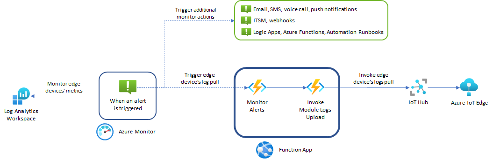

# IoT ELMS

IoT **E**dge **L**ogging and **M**onitoring **S**olution (pronounced *Lm's*) is an architecture and a sample cloud workflow that enables secure and automated retrieval of workload logs and metrics from IoT Edge devices without any additional host-level components. It leverages IoT Edge Agent's [built-in functionality to retrieve logs](https://docs.microsoft.com/azure/iot-edge/how-to-retrieve-iot-edge-logs?view=iotedge-2020-11) and IoT [Edge metrics collector](https://aka.ms/edgemon-logs) for metrics.

ELMS also provides a sample cloud workflow to process logs uploaded by the device to a blob storage container, as well as metrics arriving as device-to-cloud messages in IoT Hub. The sample can be deployed either in a sandbox environment or integrated with existing resources using an intuitive CLI wizard.


## Logging architecture reference




### High-level process flow

1. **InvokeUploadModuleLogs** is an [HTTP triggered](https://docs.microsoft.com/en-us/azure/azure-functions/functions-bindings-http-webhook-trigger?tabs=csharp) Azure Function that invokes the [upload module logs](https://docs.microsoft.com/en-us/azure/iot-edge/how-to-retrieve-iot-edge-logs?view=iotedge-2018-06#upload-module-logs) direct method on the edge agent running on every IoT edge device that matches certain criteria.
2. **ScheduleUploadModuleLogs** is a [timer triggered](https://docs.microsoft.com/en-us/azure/azure-functions/functions-bindings-timer?tabs=csharp) Azure Function that recurrently calls the function **InvokeUploadModuleLogs** via HTTP Get call.
3. The edge agent captures the logs for the requested modules and uploads them as blobs to a storage container.
4. The associated storage account is subscribed to an [event grid](https://docs.microsoft.com/en-us/azure/storage/blobs/storage-blob-event-overview) that will send all `create blob` events to a storage queue.
5. **ProcessModuleLogs** is a [storage queue triggered](https://docs.microsoft.com/en-us/azure/azure-functions/functions-bindings-storage-queue) Azure Function that loads log files and sends them to a Log Analytics workspace.


> IMPORTANT: It is important to understand that every IoT edge solution will be unique, as modules running will have different log formats and some teams may be interested in more logs than others. This solution is not meant to be a one-size-fits-all, but as an integration process to be owned, customized and deployed based on the needs of each project or team.


## Monitoring architecture reference

If the monitoring option is enabled, the following components will be created in addition to the logging architecture:





### High-level process flow:

1. The [**Metrics collector**](https://aka.ms/edgemon-docs) module will be deployed to the edge devices to scrape metrics from the modules running at the edge in Prometheus format.
2. The metrics-collector module supports uploading metrics in two ways:
   - **HTTP Post to Azure Monitor** endpoint. This option requires outbound internet connectivity from the edge device(s).
   - To other IoT modules/Hub as **IoT messages**. This option is useful for local consumption.
3. If the monitoring option is configured to upload metrics as IoT messages, an event hubs namespace and event hub instance will be used to route metric messages from IoT Hub to the Azure function **CollectMetrics**, that will then send them to Log Analytics.


## Monitor alerts architecture reference

After the solution has been deployed with the monitoring option enabled, you can run the wizard again and create/update Azure Monitor alerts in your IoT hub. The architecture below illustrates the involved resources:



### High-level process flow:

1. Alert rules are created on Azure Monitor and scoped to your IoT hub.
2. The wizard flow will give you the following choices to choose from:
   1. Pull logs from IoT edge devices periodically. This is the default behavior when you deploy the solution.
   2. Proactively pull logs from edge devices only when alerts are triggered, in which case the alerts will be linked to an Azure Function that kicks off the logs retrieval process to store them in Log Analytics for troubleshooting.
3. Optionally, you can link an existing action group to the alerts. At the moment this document was written, action groups support email, SMS, push notifications, ITSM, webhooks, Azure Functions, Logic Apps and Automation Runbooks.


> NOTE: As of August 2021, the wizard creates three query alert rules in your IoT hub that check for:
>
> - Edge devices with high disk space usage
> - Edge devices with high edge hub queue length
> - Edge devices that are offline or not sending messages upstream at an expected rate
>
> Additional alert rules can be created at any time through Azure CLI, Azure PowerShell or the Azure Portal.


## Pre-requisites

In order to successfully deploy this solution, you will need the following:

- [PowerShell](https://docs.microsoft.com/en-us/powershell/scripting/install/installing-powershell?view=powershell-7.1).
- [Azure CLI](https://docs.microsoft.com/en-us/cli/azure/install-azure-cli) version 2.21 or later.
- An Azure account with an active subscription. [Create one for free](https://azure.microsoft.com/free/?ref=microsoft.com&utm_source=microsoft.com&utm_medium=docs&utm_campaign=visualstudio).


### Prerequisite check

Verify your prerequisites to ensure you have the right version for Azure CLI. Open a PowerShell terminal and follow the instructions below:

- Run `az --version` to check that the Azure CLI version is 2.21 or later.
- Run `az login` to sign in to Azure and verify an active subscription.


## Get the code

Clone the repository:

```bash
git clone https://github.com/Azure-Samples/iotedge-logging-and-monitoring-solution.git
```


## Deploy the solution

There are two options to deploy the solution.

### Use PowerShell script

Now you will deploy the entire solution, open a PowerShell console and run the code below:

```powershell
cd iotedge-logging-and-monitoring-solution\
.\Scripts\deploy.ps1
```

The script will ask some questions regarding deployment options. Depending on the answers you provide, ELMS will have deployed the following main resources:

- IoT Hub
- Device Provisioning Service
- IoT Edge virtual machine
- Storage accounts
- App service plan and Function app
- Application Insights
- Event grid topic
- Event hubs namespace

### Use Terraform

Refer to [this documentation](docs/provision-elms-with-terraform.md) for information on how to provision the ELMS infrastructure using terraform.

> Note: [Monitor alert architecture](#monitor-alerts-architecture-reference) is not supported with the Terraform deployment.

## Understanding required application settings

The function solution receives its configuration through the application settings, these settings determine how your function will handle logs. Let's take a look at them:

- **HubHostName**: IoT Hub host name (ending in `azure-devices.net`). IoT Hub access will be granted through AAD managed identity. More info about IoT access security can be found [here](https://docs.microsoft.com/en-us/azure/iot-hub/iot-hub-devguide-security).
- **HubResourceId**: IoT Hub resource Id. This setting is used to map logs to the Azure resource and enable features like workbooks and monitoring dashboards on Azure.
- **DeviceQuery**: IoT Hub query based on device twin information to target one or many IoT edge devices. This solution adds the tag `logPullEnabled="true"` to the IoT edge device twin, so the query to target it is `SELECT * FROM devices WHERE tags.logPullEnabled='true'`. More info about querying IoT Hub for devices and modules can be found [here](https://docs.microsoft.com/en-us/azure/iot-hub/iot-hub-devguide-query-language#device-and-module-twin-queries).
- **StorageConnectionString**: Connection string for the storage account that will host the container to store logs and queue to publish events.
- **ContainerName**: Container name to upload log files to.
- **QueueName**: Storage queue to publish events to.
- **WorkspaceId**: Log analytics workspace Id. More info on how to retrieve the workspace Id can be found [here](https://www.cloudsma.com/2020/08/log-analytics-keys/).
- **WorkspaceKey**: Log analytics workspace shared key. More info on how to retrieve the shared key can be found [here](https://www.cloudsma.com/2020/08/log-analytics-keys/).
- **WorkspaceDomainSuffix**: Log analytics domain suffix. It will match the cloud you are using: `azure.com` for Azure Commercial Cloud, `azure.us` for Azure Government Cloud and `azure.cn` for Azure China Cloud.
- **LogType**: A name to group logs by in Log analytics. It can be something like `iotedgemodulelogs`.
- **EventHubName**: Event Hubs namespace authorization key with `listen` rights. It is **OPTIONAL** and required only when uploading metrics as IoT messages.
- **EventHubConsumerGroup**: Event Hubs instance consumer group to read events from. Default is `$default`. It is **OPTIONAL** and required only when uploading metrics as IoT messages.
- **EventHub__fullyQualifiedNamespace**: Event Hubs fully qualified namespace(ending in `.servicebus.windows.net`). It is **OPTIONAL** and required only when uploading metrics as IoT messages.
- **LogsIdRegex**: A regular expression that supplies the IoT edge module name. It can match multiple modules. You can use `.*` if you want to capture logs for all modules running on the IoT edge device. [.NET Regular Expressions](https://docs.microsoft.com/en-us/dotnet/standard/base-types/regular-expressions) format is expected.
- **LogsSince**: Only returns logs since this time, as a duration (1d, 90m, 2 days 3 hours 2 minutes), rfc3339 timestamp, or UNIX timestamp. It is **OPTIONAL**, if not provided, it will attempt to retrieve all logs.
- **LogsLogLevel**: Despite what the [official documentation](https://docs.microsoft.com/en-us/azure/iot-edge/how-to-retrieve-iot-edge-logs?view=iotedge-2018-06#upload-module-logs) says for the edge agent's direct methods, this setting filters log lines that match exactly the log level, following the [Syslog severity level](https://en.wikipedia.org/wiki/Syslog#Severity_level) standard. It is **OPTIONAL**, if not provided, it will retrieve logs for all log levels.
- **LogsRegex**: Used to filter log lines with content that matches the specified regular expression. [.NET Regular Expressions](https://docs.microsoft.com/en-us/dotnet/standard/base-types/regular-expressions) format is expected. **OPTIONAL**.
- **LogsTail**: Number of log lines in the past to retrieve starting from the latest. **OPTIONAL**.
- **LogsEncoding**: Logs encoding format. Options are `gzip` or `none`. Default is `gzip`.
- **LogsContentType**: Logs content type. Options are `json` or `text`. Default is `json`.
- **CompressForUpload**: Whether to compress logs and metrics when uploading them to Azure Log Analytics or IoT messages in the case of metrics. Default is `true`.


## Logging considerations

Now that you have seen the available configuration options for the solution, let's discuss some important considerations and scenarios:

- ELMS receives a single IoT hub access connection string, as a consequence only IoT edge devices within the IoT hub provided will be invoked. If your application involves monitoring multiple IoT hubs, consider deploying this solution for each IoT hub or modify the code to handle a list of IoT hub access connection strings.
- Use the **DeviceQuery** settings to target the IoT edge devices you want to capture logs from. You can add the tag `logPullEnabled="true"` to your IoT edge devices' twins to make them identifiable.
- All the resources in this solution should be deployed in the same region as the IoT Hub to avoid incurring in ingress/egress traffic and reduce latency.

- [Retrieve log](https://docs.microsoft.com/en-us/azure/iot-edge/how-to-retrieve-iot-edge-logs?view=iotedge-2018-06#recommended-logging-format) methods from the edge agent are tightly coupled with [syslog severity level](https://en.wikipedia.org/wiki/Syslog#Severity_level) standard. For best compatibility with the log retrieval feature, the recommended logging format is `<{Log Level}> {Timestamp} {Message Text}`, where `{Timestamp}` should be formatted as `yyyy-MM-dd hh:mm:ss.fff zzz`, and `{Log Level}` should follow the syslog severity level standard referenced before. Try to keep this in mind when developing your own edge modules. When you don't own or maintain the edge modules, most likely logs will differ and you won't be able to obtain the ideal format. In those cases, you can:

  - Use **LogsLogLevel** to capture exactly the log level you need to retrieve (if it matches the syslog standard) and/or use **LogsRegex** to capture certain patterns in your log lines.
  - Implement your own business logic in the **ProcessModuleLogs** function by casting the retrieved logs with the [`LogAnalyticsLog`](FunctionApp/FunctionApp/Models/Logs.cs#L26) class used in this solution.

- Some applications are very verbose, generating a log of trace and information logs. Although it is good to know that your application is performing well, it is more important to take action when things go wrong and keep costs under control. It order to achieve those goals, you should try to retrieve logs that match `warning` level or higher.

  Assume you have a module with a log output like the one below:

  ```
  <2> 2021-03-25 14:56:09.122 +00:00 [CRIT] Quantity is what you count, quality is what you count on.
  <7> 2021-03-25 14:57:09.162 +00:00 [DBG] If you're not supposed to eat at night, why is there a light bulb in the refrigerator?
  <2> 2021-03-25 14:58:09.171 +00:00 [CRIT] The road to success is always under construction.
  <7> 2021-03-25 14:59:09.213 +00:00 [DBG] I think the worst time to have a heart attack is during a game of charades.
  <4> 2021-03-25 15:00:09.272 +00:00 [WRN] Always remember you're unique, just like everyone else.
  <6> 2021-03-25 15:01:09.292 +00:00 [INF] Quantity is what you count, quality is what you count on.
  <7> 2021-03-25 15:02:09.353 +00:00 [DBG] Experience is a wonderful thing. It enables you to recognise a mistake when you make it again.
  <7> 2021-03-25 15:03:09.413 +00:00 [ERR] The road to success is always under construction.
  <7> 2021-03-25 15:04:09.462 +00:00 [DBG] I don't need a hair stylist, my pillow gives me a new hairstyle every morning.
  <2> 2021-03-25 15:05:09.502 +00:00 [CRIT] I asked God for a bike, but I know God doesn't work that way. So I stole a bike and asked for forgiveness.
  ```

  

  If you the set **LogsLogLevel** to `2`, the solution will only retrieve logs that match the `CRITICAL` level:

  ```
      <2> 2021-03-25 14:56:09.122 +00:00 [CRIT] Quantity is what you count, quality is what you count on.
      <2> 2021-03-25 14:58:09.171 +00:00 [CRIT] The road to success is always under construction.
      <2> 2021-03-25 15:05:09.502 +00:00 [CRIT] I asked God for a bike, but I know God doesn't work that way. So I stole a bike and asked for forgiveness.
  ```

  

  Alternatively, if you the set **LogsRegex** to `\b(WRN?|ERR?|CRIT?|FTL?)\b`, the solution will retrieve the following:

  ```
  <2> 2021-03-25 14:56:09.122 +00:00 [CRIT] Quantity is what you count, quality is what you count on.
  <2> 2021-03-25 14:58:09.171 +00:00 [CRIT] The road to success is always under construction.
  <4> 2021-03-25 15:00:09.272 +00:00 [WRN] Always remember you're unique, just like everyone else.
  <7> 2021-03-25 15:03:09.413 +00:00 [ERR] The road to success is always under construction.
  <2> 2021-03-25 15:05:09.502 +00:00 [CRIT] I asked God for a bike, but I know God doesn't work that way. So I stole a bike and asked for forgiveness.
  ```

  

  > NOTE: If you want to know more about how to standardize your edge modules to generate logs consistently, you can take a look at the [sample IoT edge deployment](EdgeSolution/README.md) section to see use cases for .NET Core and Python 3.x.

  

- The property **LogsSince** determines how far back to get logs, it should be aligned with how often the timer function [InvokeUploadModuleLogs](FunctionApp/FunctionApp/InvokeUploadModuleLogs.cs) runs to avoid having duplicate data or data gaps in Log analytics. If you configured the function to run every hour, then this property should be set to `1h` as well.

  > IMPORTANT: The longer you wait to run the function, the larger the log files will be, the more time it will take to process them and the longer you will have to wait to query those logs in Log analytics. Try to run them every hour or less to have access to useful data within a reasonable timeframe.


## Query logging data from Log analytics

One the solution has been deployed and it has been running enough time to let the modules generate logs; you will be able to query them in Log analytics. Go to your Log analytics resource in the Azure portal, choose Logs from the left menu and run the following sample query:

```sql
iotedgemodulelogs_CL
| where timestamp_t <= ago(24h)
| project timestamp_t, iotHub_s, deviceId_s, moduleId_s, logLevel_d, Message
```


The sample query above will return an output like the image below:


