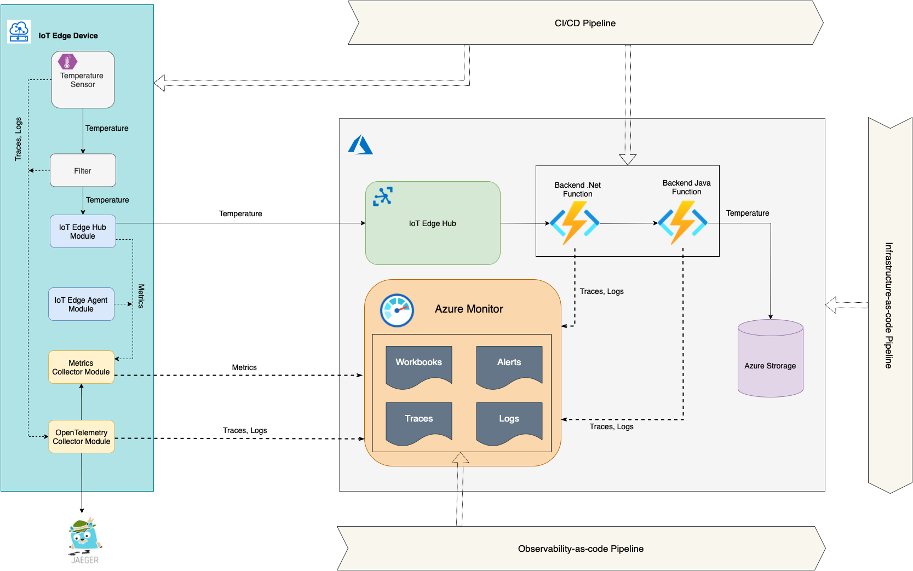

# IoT ELMS

IoT **E**dge **L**ogging and **M**onitoring **S**olution (pronounced *Lm's*) provides an implementation of an observability solution for a common IoT scenario. It demonstrates best practices and techniques regarding both observability pillars:
 
 - Measuring and Monitoring
 - Troubleshooting

## Use Case

In order to have not just abstract considerations, the sample implementation is based on a "real-life" use case:

### La Niña.


The La Niña service measures surface temperature in Pacific Ocean to predict La Niña winters. There is a number of buoys in the ocean with IoT Edge devices sending the surface temperature to Azure Cloud. The telemetry data with the temperature is pre-processed by a custom module on the IoT Edge device before sending it to the cloud. In the cloud the data is processed by a chain of two backend Azure Functions and saved to a Blob Storage. The clients of the service (sending data to ML inference workflow, decision making systems, various UIs, etc.) can pick up messages with temperature data from the Blob Storage

The topology of the sample is represented on the following diagram:



There is an IoT Edge device with `Temperature Sensor` custom module (C#) that generates some temperature value and sends it upstream with a telemetry message. This message is routed to another custom module `Filter` (C#). This module checks the received temperature against a threshold window (0-100 degrees) and if it the temperature is within the window, the FilterModule sends the telemetry message to the cloud.

In the cloud the message is processed by the backend. The backend consists of a chain of two Azure Functions and a Storage Account. 
Azure .Net Function picks up the telemetry message from the IoT Hub events endpoint, processes it and sends it to Azure Java Function. The Java function saves the message to the storage account container. 


## Measuring and Monitoring

The clients of the La Niña service have some expectations from it. These expectation may be defined as Service Level Objectives reflecting the following factors:
  
  - **_Coverage._** The data is coming from the majority of installed buoys
  - **_Freshness._** The data coming from the buoys is fresh and relevant
  - **_Throughput._** The temperature data is delivered from the buoys without significant delays.
  - **_Correctness._** The ratio of lost messages (errors) is small

These factors can be measured with the following Service Level Indicators:

|**Indicator** | **Factors** |
|----------|------|
|Ratio of on-line devices to the total number of devices| Coverage|
|Ratio of devices reporting frequently to the number of reporting devices| Freshness, Throughput|
|Ratio of devices successfully delivering messages to the total number of devices|Correctness|
|Ratio of devices delivering messages fast to the total number of devices| Throughput |  

To determine if the service satisfies the client's expectations, the Service Level Indicators (SLIs) measurements are compared to the values defined in the formal Service Level Objectives (SLOs):

|**Statement**|**Factor**|
|-------------|----------|
|90% of devices reported metrics no longer than 10 mins ago (were online) for the observation interval| Coverage |
|95% of online devices send temperature 10 times per minute for the observation interval| Freshness, Throughput |
|99% of online devices deliver messages successfully with less than 5% of errors for the observation interval| Correctness |
|95% of online devices deliver 90th percentile of messages within 50ms for the observation interval|Throughput|

Measuring templates applicable to all SLIs:
- Observation interval: 24h
- Aggregation interval: 10 mins
- Measurements frequency: 5 min
- What is measured: interaction between IoT Device and IoT Hub, further consumption of the temperature data is out of scope.

Service Level Indicators are measured by the means of metrics. An IoT Hub device comes with system modules `edgeHub` and `edgeAgent`. These modules expose through a Prometheus endpoint [a list of built-in metrics](https://docs.microsoft.com/en-us/azure/iot-edge/how-to-access-built-in-metrics?view=iotedge-2020-11#available-metrics) that are collected and pushed to Azure Monitor Log Analytics service by the [Metrics Collector module](https://docs.microsoft.com/en-us/azure/iot-edge/how-to-collect-and-transport-metrics?view=iotedge-2020-11&tabs=iothub) running on the IoT Edge device.

SLOs and corresponding SLIs are monitored with Azure Monitor Workbooks. To achieve the best user experience the workbooks system follows he **_glance -> scan -> commit_** concept:

 - **_Glance_**. SLIs at the fleet level
 - **_Scan_**. Details on how devices contribute to SLIs. Easy to identify "problematic" devices.
 - **_Commit_**. Details on a specific device
  
### Glance


### Scan


### Commit


Another monitoring instrument, which is used besides the workbooks, is Alerts. In addition to SLIs defined in SLOs, Alerts monitor secondary metrics (KPIs) to predict and prevent the defined SLOs violations: 

|**Metric**|**Factor**|
|----------|----------|
|Device last seen time | Coverage |
|Device upstream message ratio (messages per min)| Freshness, Throughput|
|Device messages Queue Len|Throughput|
|Device messages Latency|Throughput|
|Device CPU, Memory, disk usage | Coverage, Freshness, Throughput |
|Device messages error ratio| Correctness |


## Troubleshooting 

While **_Measuring and Monitoring_** allows to observe and predict the system behavior, compare it to the defined expectations and ultimately detect existing or potential issues, the **_Troubleshooting_** lets identify and locate the cause of the issue.

There are two observability instruments serving the troubleshooting purposes: **_Traces_** and **_Logs_**. In this sample Traces show how a telemetry message with the ocean surface temperature is traveling from the sensor to the storage in the cloud, what is invoking what and with what parameters. Logs give information on what is happening inside each system component during this process. The real power of Traces and Logs comes when they are correlated. With that it's possible to read the logs of a specific system component, such as a module on IoT device or a backend function, while it was processing a specific telemetry message.

It is very common in IoT scenarios when there is only one way connectivity from the devices to the cloud. Due to unstable and complicated networking setup there is no way to connect from the cloud to the devices at scale. This sample is built with this limitation in mind, so the observability data (as any data) is supposed to be pushed to the cloud rather than pulled. Please refer to the [Overview of Distributed Tracing with IoT Edge](./docs/iot-edge-distributed-tracing.md) for the detailed considerations and different architecture patterns on distributed tracing.  

### OpenTelemetry

The C# components of the sample, such as device modules and backend Azure .Net Function use [OpenTelemetry for .Net](https://github.com/open-telemetry/opentelemetry-dotnet/blob/main/src/OpenTelemetry.Api/README.md#introduction-to-opentelemetry-net-tracing-api) to produce tracing data.

IoT Edge modules `Tempperature Sensor` and `Filter` export the logs and tracing data via OTLP protocol to the [OpenTelemetryCollector](https://opentelemetry.io/docs/collector/) module, running on the same edge device. The `OpenTelemetryCollector` module, in its turn, exports logs and traces to Azure Monitor Application Insights service.

The Azure .Net backend Function sends the tracing data to Application Insights with [Azure Monitor Open Telemetry direct exporter](https://docs.microsoft.com/en-us/azure/azure-monitor/app/opentelemetry-enable?tabs=net). It also send correlated logs directly to Application Insights with a configured ILogger instance.

The Java backend function uses [OpenTelemetry auto-instrumentation Java agent](https://docs.microsoft.com/en-us/azure/azure-monitor/app/java-in-process-agent) to produce and export tracing data and correlated logs to the Application Insights instance.  

The IoT Edge module `Tempperature Sensor` starts the whole process and therefore it starts an OpenTelemetry trace. It puts a [W3C traceparent](https://www.w3.org/TR/trace-context/#relationship-between-the-headers) value into the outgoing message property. The `Filter` receives the message on the device, extracts the `traceparent` property and uses it to continue the trace with a new span. The module puts a new value of the `traceparent` (with the new parent_id) into the outgoing message. The .Net Azure Function retrieves the message from the IoT Hub endpoint, extracts the `traceparent` property, continues the same trace with a new span and sends the new `traceparent` value in the header of the HTTP request to the Azure Java Function. The Azure Java Function is auto-instrumented with OpenTelemetry, so the framework "understands" the `traceparent` header, starts a new span in the same trace and creates the following spans while communicating to Azure Blob Storage and Managed Identity service. 
  
As a result, the entire end-to-end process from the sensor to the storage can be monitored with Application Map in Application Insights:


Blobs in Azure Storage with the IoT messages are tagged with the `trace_id` (`Operation Id` in Application Insights) value. We can find and investigate in details end-to-end transaction for every message.   


We can go deeper and drill down and explore correlated logs for a specific trace or a specific span. In Application Insights terminology `Operation Id` corresponds to `TraceId` and `Id` corresponds to `SpanId`:


Besides Application Insights, the `OpenTelemetryCollector` module can be configured to export the tracing data to alternative observability backends, working on the factory floor (for example [Jaeger](https://www.jaegertracing.io) or [Zipkin](https://zipkin.io)). This enables the scenarios when the device goes offline but we still want to analyze what is happening on the device or we want to do the device analysis without a roundtrip to the cloud. 

_Note_: Jaeger/Zipkin installation is not included in this sample. If you have a Jaeger installation that you want to work with this sample, provide a value of the `JAEGER_ENDPOINT` environment variable (e.g. http://myjaeger:14268/api/traces) in the device deployment template.


## DevOps practices

Implementing DevOps practices is a common way to handle with the growing complexity of observability implementation and related operational costs. 
This sample comes with the following Azure Pipelines:

### Infrastructure-as-code

[Infrastructure-as-code pipeline](.pipelines/iac.yaml) provisions all necessary Azure resources for this sample. It is referencing `iot-monitoring` variable group that should be created manually in your Azure DevOps project with the following variables:

|**Variable**|**Description**|**Example**|
|----------|----------|----------|
|AZURE_RESOURCE_MANAGER_CONNECTION_NAME| Name of ARM service connection in the Azure DevOps project | iotsample-arm-con |
|AZURE_LOCATION| Azure Location | West US 2 |
|RG_NAME| Azure Resource Group Name | iot-e2e-rg|
|IOT_ENV_SUFFIX| Unique suffix that will be added to all provisioned resources | iote2esampl |

### Observability-as-code

[Observability-as-code pipeline](.pipelines/observability-as-code.yaml) deploys a sample Workbook and a set of Alerts and assigns them to IoT Hub.
It requires to add the following variables in the `iot-monitoring` variable group (in addition to the variables defined for IaC): 

|**Variable**|**Description**|**Example**|
|----------|----------|----------|
|AZURE_SUBSCRIPTION_ID| Azure subscription Id where IoT Hub is provisioned | XXX-XXX-XXX-XXX-XXX |

### CI/CD

[CI/CD pipeline](.pipelines/cicd.yaml) performs the following:
  
  - Builds IoT Edge Modules Docker Images
  - Runs a local smoke test to check the IoT Edge Modules containers work without errors
  - Pushes the images to ACR (provisioned by the IaC pipeline)
  - Builds and archives to zip files backend Azure Functions
  - Publishes artifacts consisting of IoT Edge devices deployment profiles and backend functions archives
  - Creates a new IoT Edge device deployment in IoT Hub
  - Runs a smoke test to check the deployment is applied and the devices are up and running
  - Deploys backend Azure Functions

It requires to add the following variables in the `iot-monitoring` variable group (in addition to the variables defined for IaC): 

|**Variable**|**Description**|**Example**|
|----------|----------|----------|
|LOG_ANALYTICS_SHARED_KEY| Log Analytics Shared Key, used by devices to export metrics | XXX |
|LOG_ANALYTICS_WSID| Log Analytics Workspace Id, used by devices to export metrics | XXX-XXX-XXX-XXX-XXX |
|APPINSIGHTS_INSTRUMENTATION_KEY| Application Insights Instrumentation Key, used by devices to export logs and traces | XXX |


## Deployment with a script

While Azure Pipelines is a must have for a production environment, the sample comes with an alternative and convenient option for the quick `deploy-n-play`. You can deploy everything with a PowerShell script `./Scripts/deploy.ps1`. The script provisions all necessary Azure resources, deploys a sample workbook and alerts, deploys IoT Edge Modules and backend Azure Functions.  

_Note_: The script prompts to select one of the available deployment options: `End-to-End Sample` or `Cloud Workflow Sample`. The `End-to-End Sample` option deploys the sample described above in this document and `Cloud Workflow Sample` option deploys a sample of a cloud workflow to process logs uploaded by the device to a blob storage container, as well as metrics arriving as device-to-cloud messages in IoT Hub. Refer to the [Cloud Workflow Sample](docs/CloudWorkflow.md) for the details.


### Pre-requisites

In order to successfully deploy this sample with a script, you will need the following:

- [PowerShell](https://docs.microsoft.com/en-us/powershell/scripting/install/installing-powershell?view=powershell-7.1).
- [Azure CLI](https://docs.microsoft.com/en-us/cli/azure/install-azure-cli) version 2.21 or later.
- An Azure account with an active subscription. [Create one for free](https://azure.microsoft.com/free/?ref=microsoft.com&utm_source=microsoft.com&utm_medium=docs&utm_campaign=visualstudio).


### Prerequisite check

Verify your prerequisites to ensure you have the right version for Azure CLI. Open a PowerShell terminal and follow the instructions below:

- Run `az --version` to check that the Azure CLI version is 2.21 or later.
- Run `az login` to sign in to Azure and verify an active subscription.


### Get the code

Clone the repository:

```bash
git clone https://github.com/Azure-Samples/iotedge-logging-and-monitoring-solution.git
```


### Deploy the sample

```powershell
cd iotedge-logging-and-monitoring-solution\
.\Scripts\deploy.ps1
```
  


 

