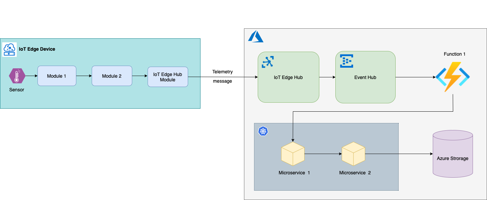
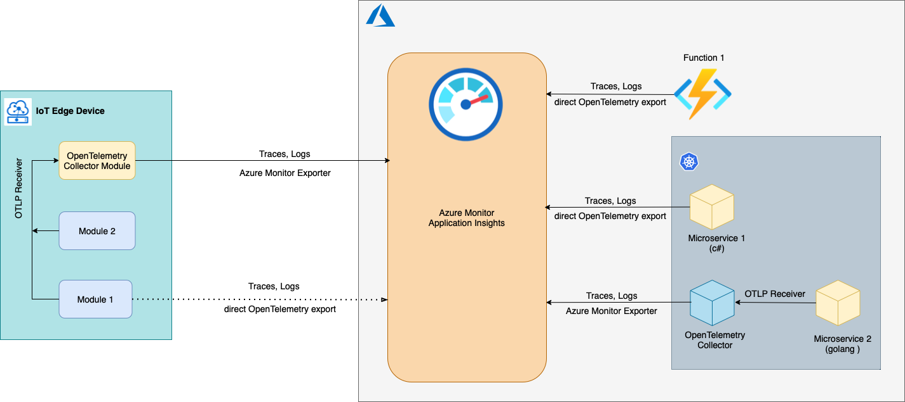
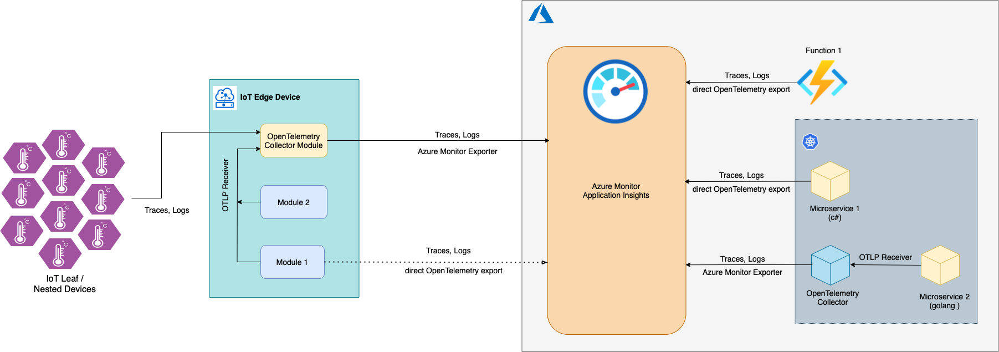
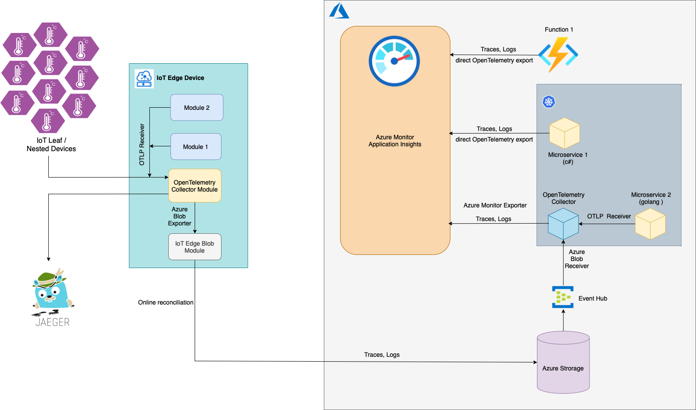

# Distributed Tracing with IoT Edge 

## Challenge

Processing of telemetry data coming from an edge device may include multiple running pieces. For example: sensor->module 1->module-2>IoT Hub->function 1->microservice 1->microservice 2->storage.

While diagnosing and troubleshooting a problem such as "the data didn't arrive to the storage" or even worse "the data arrived but it's not what was expected", it's hard to "trace" how the data was traveling and what was happening at every single station. Hence distributed "tracing".

As a matter of fact, in many cases we know how the data was traveling as the flows are mostly straight forward, but we don't know what was happening at every point in the flow when this specific data was processed. This is the real challenge.

In IoT world the solution is getting more complicated as the flow consists of two parts: device and the cloud. While the flow steps in the cloud always have a direct access to the cloud tracing services (App Insights) and can flush their tracing data just on-the-fly, the steps happening in the device don't have this privilege as they are often offline and connection to the cloud service is very limited/restricted.

Besides the standard use-case of sending telemetry data from devices to the cloud, there are other scenarios which would also benefit from distributed tracing functionality:
- Device-to-cloud file upload
- Cloud-to-device messages
- Cloud-to-device direct method invocation 
- Direct access to external/cloud services from the device  

## Approach
- Instrument custom modules on IoT Edge device with OpenTelemetry to report tracing.
- The key component to route OpenTelemetry tracing data and logs to the observability backend (e.g. App Insights, Jaeger, Zipkin, etc.) is [OpenTelemetry Collector](https://github.com/open-telemetry/opentelemetry-collector/blob/main/docs/design.md) which may work on the device as a module and in the cloud as an Azure Function or K8s microservice.
- All modules on the device should export traces and logs to OpenTelemetry Collector Module via [OpenTelemetry Protocol Exporter](https://github.com/open-telemetry/opentelemetry-specification/blob/main/specification/protocol/exporter.md) (e.g. with [OTLP exporter](https://github.com/open-telemetry/opentelemetry-dotnet/blob/main/src/OpenTelemetry.Exporter.OpenTelemetryProtocol/README.md)). This decouples the module code from the details on how/where the tracing data is going to be used.

### Online IoT Edge devices
- On the devices that are mostly/normally online, the OpenTelemetry Collector Module is configured to receive traces and logs with [OTLP Receiver](https://github.com/open-telemetry/opentelemetry-collector/blob/main/receiver/otlpreceiver/README.md) and to export the data to Azure Monitor (App Insights) via [Azure Monitor Exporter for OpenTelemetry Collector](https://github.com/open-telemetry/opentelemetry-collector-contrib/tree/main/exporter/azuremonitorexporter). See [an example of IoT Edge deployment](../EdgeSolution/e2e.deployment.template.json) with an OpenTelemetry Collector confiured to export OTLP data to Azure Monitor.             
  - Alternatively, the devices that are always online (can't work otherwise) and have a stable connection with the cloud may have custom modules export traces and logs directly to App Insights with [Azure Monitor OpenTelemetry exporter](https://docs.microsoft.com/en-us/azure/azure-monitor/app/opentelemetry-enable?tabs=net#enable-azure-monitor-application-insights). In this case they don't need to have OpenTelemetry Collector Module on the device.

### Leaf devices
- [IoT leaf](https://docs.microsoft.com/azure/iot-fundamentals/iot-glossary#leaf-device) devices normally sit on the lower network levels without access to Azure Cloud, they might be implemented with languages lke C/C++, Rust, so there is no App Insights SDK available for them, these devices are normally small and not capable to host something like OpenTelemtry Collector on their own.
-  Leaf devices export their traces and logs via OTLP protocol to the IoT Edge device which plays a role of a gateway and resends everything to the cloud.

### Offline IoT Edge devices
- On the devices that may be normally offline, the OpenTelemetry Collector Module is configured to export traces and logs to [Azure Blob Storage module](https://docs.microsoft.com/azure/iot-edge/how-to-store-data-blob) via _Azure Blob Exporter_. This module keeps the tracess and logs on the device as long as it is offline. Once the device is online, [Azure Blob Storage module](https://docs.microsoft.com/azure/iot-edge/how-to-store-data-blob) automatically replicates the data to the blob storage account in the cloud. See [an example of IoT Edge deployment](../EdgeSolution/e2e.deployment.offline.template.json) with an OpenTelemetry Collector and an Azure Blob Storage module. On the cloud side there is an OpenTelemetry Collector instance running and reading traces and logs from the blob storage with _Azure Blob Receiver_  and exports the data to Azure Monitor via [Azure Monitor Exporter](https://github.com/open-telemetry/opentelemetry-collector-contrib/tree/main/exporter/azuremonitorexporter). See an example of [OpenTelemetry Collector configuration](../Backend/OpenTelemetryCollector/) running in the cloud.
    - OpenTelemetry Collector instance in the cloud can be deployed as a pod on an [AKS](https://azure.microsoft.com/services/kubernetes-service/) instance or as a container on [ACI](https://docs.microsoft.com/azure/container-instances/) or just as a standalone instance on a VM
    - OpenTelemetry Collector _Azure Blob Receiver_ is [subscribed](https://docs.microsoft.com/azure/storage/blobs/storage-blob-event-overview#the-event-model) on Azure Blob Storage events and when a new trace or log arrives to the cloud storage from th device, the receiver reads the data from the blob and transfers it to Azure Monitor. 
    - Alternatively, for the devices that are mostly offline and/or not supposed to report much to the cloud, the tracing data can be forwarded by OpenTelemetry Collector Module to an open source observability backend (e.g. Jaeger, Zipkin) using one of [available exporters](https://github.com/open-telemetry/opentelemetry-collector-contrib/tree/main/exporter). 
    

- All services in the cloud, that are included in the flow may export OpenTelemetry traces to Azure Monitor with the [direct exporter](https://docs.microsoft.com/en-us/azure/azure-monitor/app/opentelemetry-overview#sending-your-telemetry) from the code or they may use OTLP to export traces to the OpenTelemetry Collector instance in the cloud. The latter covers cases when services are not implemented with one of [supported by Azure Monitor languages](https://docs.microsoft.com/en-us/azure/azure-monitor/app/platforms), for example GoLang or C/C++.
- All steps in the flow (modules on the device and services in the cloud) should leverage OpenTelemetry Tracing API components such as [Span Attributes](https://github.com/open-telemetry/opentelemetry-specification/blob/main/specification/trace/api.md#set-attributes) to store deviceid, sensorid, gateway, etc. and [Span Events](https://github.com/open-telemetry/opentelemetry-specification/blob/main/specification/trace/api.md#add-events) to store essential logs that should be exported with tracing data.
- D2C and C2D messages should contain [tracing span context](https://opentelemetry.io/docs/reference/specification/overview/#spancontext) injected in the message system properties. It can be extracted and used by receiving modules and backend services to [continue the trace](https://opentelemetry.io/docs/concepts/data-sources/#traces). This may require using [Context propagation techniques](https://github.com/open-telemetry/opentelemetry-dotnet/blob/main/src/OpenTelemetry.Api/README.md#context-propagation).

## Resources
- [Trace Azure IoT device-to-cloud messages with distributed tracing](https://docs.microsoft.com/en-us/azure/iot-hub/iot-hub-distributed-tracing)
- [E2E diagnostic provision CLI](https://github.com/Azure-Samples/e2e-diagnostic-provision-cli)
- [E2E diagnostic event hub function ](https://github.com/Azure-Samples/e2e-diagnostic-eventhub-ai-function)
- [OpenTelemetry and Tracing](https://lightstep.com/blog/opentelemetry-101-what-is-tracing/)
- [OpenTelemetry and Logs](https://github.com/open-telemetry/opentelemetry-specification/blob/main/specification/logs/overview.md#via-file-or-stdout-logs)
- [OpenTelemetry Collector](https://github.com/open-telemetry/opentelemetry-collector/blob/main/docs/design.md)
- [Azure Monitor Exporter for OpenTelemetry Collector](https://github.com/open-telemetry/opentelemetry-collector-contrib/tree/main/exporter/azuremonitorexporter)
- [OpenTelemetry .Net API](https://github.com/open-telemetry/opentelemetry-dotnet/blob/main/src/OpenTelemetry.Api/README.md#introduction-to-opentelemetry-net-tracing-api)
- [Sending telemetry to Azure Monitor](https://docs.microsoft.com/en-us/azure/azure-monitor/app/opentelemetry-overview#sending-your-telemetry)
- [OpenTelemetry LightStep](https://opentelemetry.lightstep.com)
- [Collect and Transport Metrics](https://docs.microsoft.com/en-us/azure/iot-edge/how-to-collect-and-transport-metrics?view=iotedge-2020-11&tabs=iothub)
- [Logging Approaches](https://www.cwcwiki.com/wiki/IoT_and_Intelligent_Edge_Resources-_Edge_Observability)
- [Tree Pillars of Observability](https://www.oreilly.com/library/view/distributed-systems-observability/9781492033431/ch04.html)